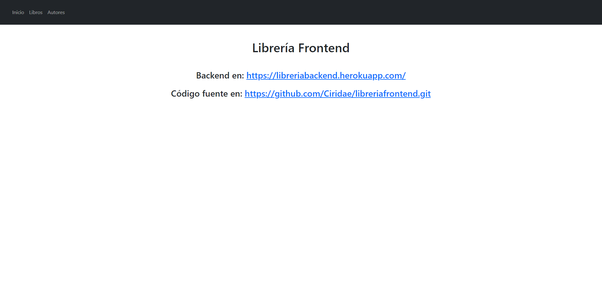

#  Frontend de Aplicación con Svelte

En este repositorio encontramos el código para crear la parte Frontend con Svelte para hacer peticiones CRUD a una API.


##  Iniciar un proyecto de Svelte

Para iniciar nuestro proyecto de Svelte, utilizaremos una [plantilla de archivos](https://github.com/sveltejs/template) que se encuentra en un repositorio de GitHub:

```console

npx degit sveltejs/template libreriafrontend

```


## Comprobar el proyecto creado

Desde la carpeta que se ha creado, ejecutamos el comando `tree` para ver el contenido del proyecto:

```
├── package.json
├── public
│   ├── favicon.png
│   ├── global.css
│   └── index.html
├── README.md
├── rollup.config.js
└── src
    ├── App.svelte
    └── main.js
```


## Trabajar  con Svelte

Para empezar, necesitamos descargar las dependencias de nuestro proyecto, estas se encuentran en el archivo `package.json`. Para ello ejecutamos:

```
npm  install
```

Para ejecutar la aplicación en modo desarrollo deberemos ejecutar:

```console
npm  run  dev
```

Para ver nuestra aplicación vamos a [localhost:5000](http://localhost:5000).




## Definir nuestro primer componente

En el componente `App.svelte` vamos a definir la estructura y como se comportará nuestra página.

```html
<script>
	import { setContext } from  "svelte";
	import { Router } from  "svelte-routing";
	import  Contenido  from  "./Contenido.svelte";
	import  Nav  from  "./Nav.svelte";

	const  URL = {
	libros:  "https://libreriabackend.herokuapp.com/api/libros/",
	autores:  "https://libreriabackend.herokuapp.com/api/autores/",
	};  

	setContext("URL", URL);
</script>
  
<Router>
	<Nav />
	<Contenido />
</Router>

<style>
	:global(*) {
		margin: 0;
		padding: 0;
	}

	:global(body) {
		margin: 0;
		padding: 0;
	}
</style>
```

En la sección de `script` importamos los paquetes y componentes que vayamos a usar. El componente `Router` que está en el paquete `svelte-routing`. Con este paquete tenemos los componentes necesarios para crear enrutadores (`Router`), enlaces (`Link`) y rutas (`Route`). Svelte no trae esto por defecto, por lo que hay que instalar el paquete:

```console
npm  install  svelte-routing
```

Vamos a importar también los componentes `Nav` y `Contenido`, que crearemos más adelante. 

La estructura del componente `App` está formada por un `Router`, dentro del cual se definen dos componentes: `Nav`, que tendrá los enlaces (`Link`) necesarios para la navegación, y `Contenido`, que tendrá las rutas (`Routes`) a los componentes necesarios.


## Componentes de navegación y contenido

Crearemos dos componentes llamados `Nav.svelte` y `Contenido.svelte`. Debe estar en la misma carpeta que el componente `App.svelte`.

**`Nav.svelte`**

```html
<script>
  import { Link } from "svelte-routing";
</script>

<nav  class="navbar navbar-expand-md navbar-dark bg-dark">
	<div  class="container-fluid">
		<button  class="navbar-toggler"  type="button"  data-bs-toggle="collapse"  data-bs-target="#navbarNav"  aria-controls="navbarNav"  aria-expanded="false">
			<span  class="navbar-toggler-icon"></span>
		</button>
		<div  class="collapse navbar-collapse"  id="navbarNav">
			<ul  class="navbar-nav">
				<li  class="nav-item">
					<Link  class="nav-link"  to="/">Inicio</Link>
				</li>
				<li  class="nav-item">
					<Link  class="nav-link"  to="/libros">Libros</Link>
				</li>
				<li  class="nav-item">
					<Link  class="nav-link"  to="/autores">Autores</Link>
				</li>
			</ul>
		</div>
	</div>
</nav>

<style>
	nav {
		background-color: antiquewhite;
		padding: 20px;
	}

	ul {
		display: flex;
		justify-content: space-evenly;
		list-style-type: none;
	}
</style>
```

El componente `Nav` será la barra de navegación (`nav`), con los enlaces a las rutas del lado cliente. Para los enlaces hacemos uso del componente `Link` del paquete `svelte-routing`.

**`Contenido.svelte`**

```html
<script>
	import { Route } from "svelte-routing";
	import {Route} from  "svelte-routing";
	import  Autores  from  "./Autores.svelte";
	import  Inicio  from  "./Inicio.svelte";
	import  Libros  from  "./Libros.svelte";
</script>

<main  class="container">
	<Route  path="/"  component="{Inicio}"></Route>
	<Route  path="/libros"  component="{Libros}"></Route>
	<Route  path="/autores"  component="{Autores}"></Route>
</main>
```

El componente `Contenido` será la sección principal (`main`), con las rutas y el componente asociado a cada una de ellas. Para las rutas hacemos uso del componente `Route` del paquete `svelte-routing`.

## Componentes para el contenido

Dentro del componente anterior `Contenido` podrán renderizarse distintos componentes, dependiendo del `Link` que pulsemos en la barra de navegación. Los componentes que podrán aparecer en `Contenido` son:

- **Inicio**
- **Libros**
- **Autores**

**`Inicio.svelte`**

```html
<div  class="text-center mt-5">
	<h1>Librería Frontend</h1>
	<h3  class="mt-5 mb-4">Backend en: <a  href="https://libreriabackend.herokuapp.com/"  target="_blank"  rel="noreferrer">https://libreriabackend.herokuapp.com/</a></h3>
	<h3>Código fuente en: <a  href="https://github.com/Ciridae/libreriafrontend.git"  target="_blank"  rel="noreferrer">https://github.com/Ciridae/libreriafrontend.git</a></h3>
</div>
```

Este componente mostrará información acerca de la aplicación. Sólo posee código HTML y CSS. No necesita solicitar datos al servidor. Por tanto su carga es inmediata, y por este motivo lo mostraremos nada más iniciarse la aplicación. Ello permite una carga inicial de la aplicación instantánea.


**`Libros.svelte`**


 ```html
 <script>
    import { getContext } from "svelte";
    import { data } from "./store";
    import { onMount } from "svelte";
    import Buscar from "./Buscar.svelte";
    import Libro from "./Libro.svelte";
    import Boton from "./Boton.svelte";

    const URL = getContext("URL");
    let datosFiltrados = [];
    let patron = "";
    let libroInsertar = {};

    let getLibros = async () => {
        const response = await fetch(URL.libros);
        $data = await response.json();
    };

    onMount(getLibros);

    $: datosFiltrados = $data.filter((libro) =>
        RegExp(patron, "i").test(libro.titulo)
    );
</script>

<h1 class="pt-5">Libros</h1>

<div class="row">
    <div class="col-12">
        <div class="contenedor border rounded p-2">
            <Buscar bind:busqueda={patron} />
        </div>
    </div>
    <div class="col-12">
        <div class="contenedor border rounded p-2 mt-3">
            <Libro bind:libro={libroInsertar}>
                <Boton coleccion="libros" documento={libroInsertar} />
            </Libro>
        </div>
    </div>
</div>

<div class="row row-cols-1 row-cols-sm-2 row-cols-lg-3 py-3">
    {#each datosFiltrados as libro}
        <div class="col">
            <div class="p-2 border rounded contenedor mb-4">
                <Libro bind:libro>
                    <Boton
                        tipo="modificar"
                        coleccion="libros"
                        documento={libro}
                    />
                    <Boton
                        tipo="eliminar"
                        coleccion="libros"
                        documento={libro}
                    />
                </Libro>
            </div>
        </div>
    {/each}
</div>

```

**`Autores.svelte`**

```html
<script>
    import { getContext } from "svelte";
    import { data } from "./store";
    import { onMount } from "svelte";
    import Autor from "./Autor.svelte";
    import Boton from "./Boton.svelte";
    import Buscar from "./Buscar.svelte";

    const URL = getContext("URL");
    let datosFiltrados = [];
    let patron = "";
    let autorInsertar = {};

    let getAutores = async () => {
        const response = await fetch(URL.autores);
        $data = await response.json();
    };

    onMount(getAutores);

    $: datosFiltrados = $data.filter((autor) =>
        RegExp(patron, "i").test(autor.nombre)
    );
</script>

<h1 class="pt-5">Autores</h1>

<div class="row">
    <div class="col-12">
        <div class="contenedor border rounded p-2">
            <Buscar bind:busqueda={patron} />
        </div>
    </div>
    <div class="col-12">
        <div class="contenedor border rounded p-2 mt-3">
            <Autor bind:autor={autorInsertar}>
                <Boton coleccion="autores" documento={autorInsertar} />
            </Autor>
        </div>
    </div>
</div>

<div class="row row-cols-1 row-cols-sm-2 row-cols-lg-3 py-3">
    {#each datosFiltrados as autor}
        <div class="col">
            <div class="p-2 border rounded contenedor mb-4">
                <Autor bind:autor>
                    <Boton tipo="modificar" coleccion="autores" documento={autor} />
                    <Boton tipo="eliminar" coleccion="autores" documento={autor} />
                </Autor>
            </div>
        </div>
    {/each}
</div>
```

## Otros componentes

**`Libro.svelte`**

```html
<script>
    export let libro = { titulo: "", precio: 0 };
</script>

<div class="my-3">
    <input class="form-control mb-2" type="text" placeholder="Titulo" bind:value={libro.titulo} />
    <input class="form-control" type="number" placeholder="Precio" bind:value={libro.precio} />
</div>
<slot />
```

**`Autor.svelte`**

```html
<script>
    export let autor = { nombre: "", apellidos: "" };
</script>

<div class="my-3">
    <input class="form-control mb-2" type="text" placeholder="Nombre" bind:value={autor.nombre} />
    <input class="form-control" type="text" placeholder="Apellidos" bind:value={autor.apellidos} />
</div>
<slot />
```

**`Boton.svelte`**

```html
<script>
    import { onMount } from "svelte";
    import { getContext } from "svelte";
    import { data } from "./store";

    export let tipo = "insertar";
    export let documento = {};
    export let coleccion = "";

    let enlace = "";
    let URL = getContext("URL");

    if (coleccion == "libros") {
        enlace = URL.libros;
    } else if (coleccion == "autores") {
        enlace = URL.autores;
    }

    let handler = () => {};

    function insertar() {
        let opciones = {
            method: "POST",
            headers: { "Content-Type": "application/json" },
            body: JSON.stringify(documento),
        };
        fetch(enlace, opciones)
            .then((res) => res.json())
            .then((doc) => ($data = [...$data, doc]))
            .catch((error) => console.log(error));
    }

    function modificar() {
        let opciones = {
            method: "PUT",
            headers: { "Content-Type": "application/json" },
            body: JSON.stringify(documento),
        };
        fetch(enlace + documento._id, opciones)
            .then((res) => res.json())
            .then((datos) => console.log(datos))
            .catch((error) => console.log(error));
    }

    function eliminar() {
        let opciones = {
            method: "DELETE",
        };
        fetch(enlace + documento._id, opciones)
            .then((res) => res.json())
            .then(($data = $data.filter((doc) => doc._id != documento._id)))
            .catch((error) => console.log(error));
    }

    function setup() {
        switch (tipo) {
            case "insertar":
                handler = insertar;
                break;
            case "modificar":
                handler = modificar;
                break;
            case "eliminar":
                handler = eliminar;
                break;
            default:
                break;
        }
    }

    onMount(setup);
</script>

<input class="boton" type="button" value={tipo.toUpperCase()} on:click={handler} />

```

**`Buscar.svelte`**

```html
<script>
    export let busqueda = "";
</script>

<label for="buscar">Buscar:</label>
<input id="buscar" class="form-control" type="search" bind:value={busqueda}>
```
## Pasar información entre componentes

### Propiedades

Desde el componente padre `Libros` pasamos el valor `camisa` a la propiedad `busqueda` del componente `Buscar`.

Por defecto, el sentido de la comunicación es Padre->Hijo. 

Si deseamos que el hijo (`Buscar`) pueda pasar información al padre (`Libros`) haremos uso de la directiva **`bind`** en el componente padre, que quedaría así:

```html
<script>
    let texto = "camisa";
</script>

<Buscar bind:busqueda={texto} />
```

El valor de la propiedad `busqueda`, que será modificada desde el componente `Buscar`, "subirá" hasta la variable `texto` del componente `Libros`.


### Contextos (setContext / getContext)

**`App.svelte`**

```html
<script>
    import { setContext } from "svelte";
	
    const URL = {
        libros: "https://libreriabackend.herokuapp.com/api/libros/",
        autores: "https://libreriabackend.herokuapp.com/api/autores/",
    };

    setContext("URL", URL);
</script>	
```

**`Boton.svelte`**

```html
<script>
    import { getContext } from "svelte";
	
    let enlace = "";
    let URL = getContext("URL");

    if (coleccion == "libros") {
        enlace = URL.libros;
    } else if (coleccion == "autores") {
        enlace = URL.autores;
    }
</script>
```
### Almacenes (stores)

**`store.js`**

 ```javascript
import { writable } from "svelte/store";

export const data = writable( [] );
```

Declaramos en `store.js` un array vacío, que contendrá datos en formato JSON.


**`Libros.svelte`**

```html
<script>
    import { data } from "./store";
	
    let getLibros = async () => {
        const response = await fetch(URL.libros);
        $data = await response.json();
    };

    onMount(getLibros);
</script>	
```

En el componente `Libros.svelte` hacemos una petición **fetch** al servidor y guardamos los datos en formato JSON en la variable data del almacén. 

**Boton.svelte**

```html
<script>
  import { data } from "./store";
  export let documento = {};
	
    function insertar() {
        let opciones = {
            method: "POST",
            headers: { "Content-Type": "application/json" },
            body: JSON.stringify(documento),
        };
        fetch(enlace, opciones)
            .then((res) => res.json())
            .then((doc) => ($data = [...$data, doc]))
            .catch((error) => console.log(error));
    }
	
</script>
```

En el componente `Boton.svelte` insertamos un nuevo libro en el servidor mediante una petición **fetch** de tipo POST. Si se guarda correctamente en el servidor, entonces actualizamos en consecuencia nuestra variable data del almacén:

**`$data = [...$data, doc]`**

## Single-Page App

Para que nuestra página responda a las peticiones desde cualquier ruta tenemos que editar el comando `"start"` en package.json:

```js
"start": "sirv public --single"
```


## Despliegue en la web con Vercel

En mi caso he utilizado [vercel](https://vercel.com), el cual es muy sencillo. Simplemente seguimos las instrucciones que nos indican, asociamos un repositorio de GitHub y le asignamos un nombre. 

Tras unos instante ya tenemos nuestro frontend desplegado.
